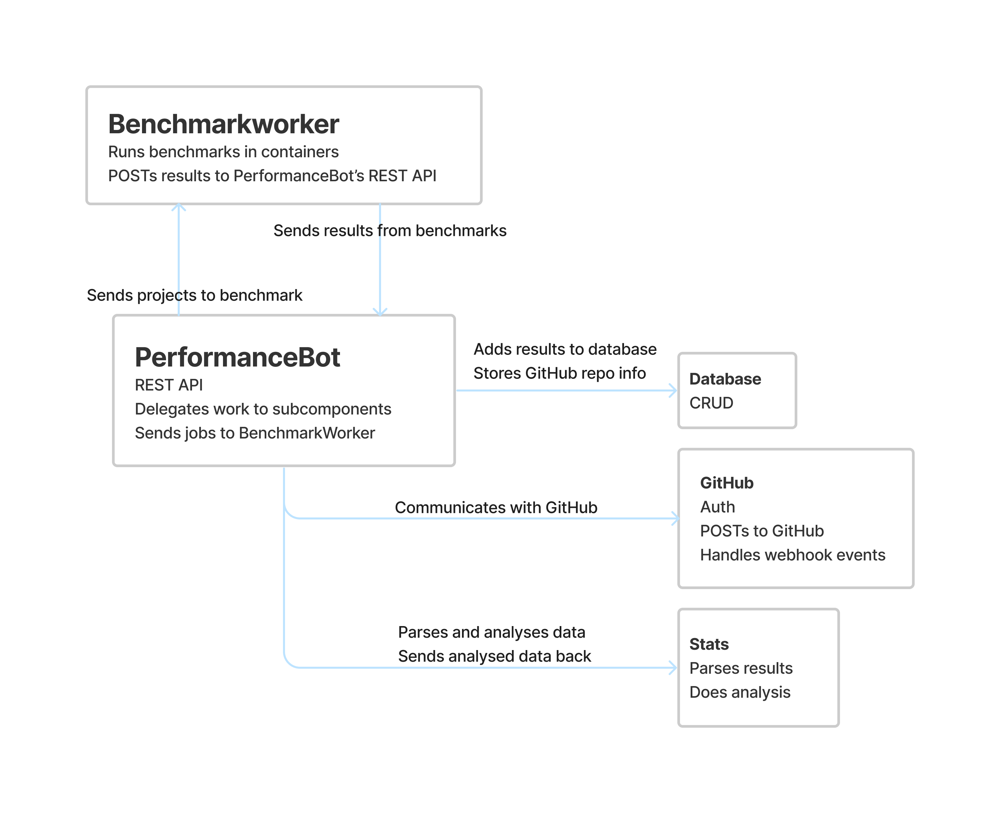
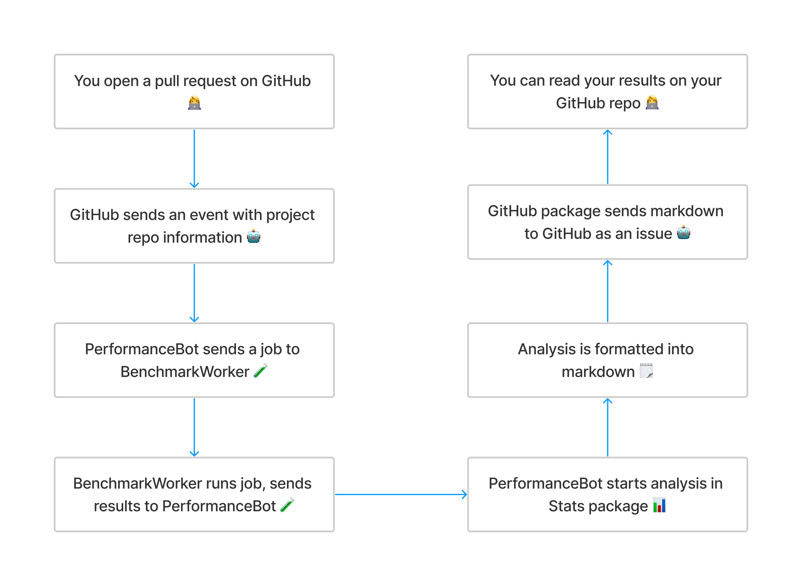

# **Halftime** - Developing an Open Source Performance Benchmarking Git Bot

**Students:** Ali Alkhaled, Elin Hagman, Samuel Kajava, Jonathan Linder, Kasper Ljunggren & Linus Lundgren

**Supervisor:** Philipp Leitner

---

## The Problem

Using Continuous Integration (CI) for evaluating programs is necessary for a project's longevity, and is most commonly based on running tests - **it works or it doesn't**.

**What about performance?** Few tools exist to run performance benchmarks in projects, and bugs slowing down the code remain hidden as a result. Similar CI tools for this kind of evaluation barely exist at all.

## Our Task

Provide a **GitHub Bot** for developers who wants to measure their projects' performance continuously.

---

---

---

<h2> Progress and Continunation - Development</h2>

<h3 style="margin-top: 0"> Progress </h3>

-   Receive webhook events
-   Run code in containers
-   Store results in database
-   Open GitHub issue with results

### Upcoming

-   **Statistical analysis and presentation**
-   **Configurability** - build tools, which tests to run, etc.
-   **Deployment** - ship the bot and make it available for public use

---

## Scientific Relevancy and our Thesis

-   Eliminating unnecessary work
-   Providing inspiration
-   Establishing a basis for future work

---

## Evaluation Ideas

-   Running large projects
-   Communication

## Some Experiences

-   Large stack
-   Learning by doing
-   Going from low level to high level languages

---

# Questions?

<!-- _class: invert -->
